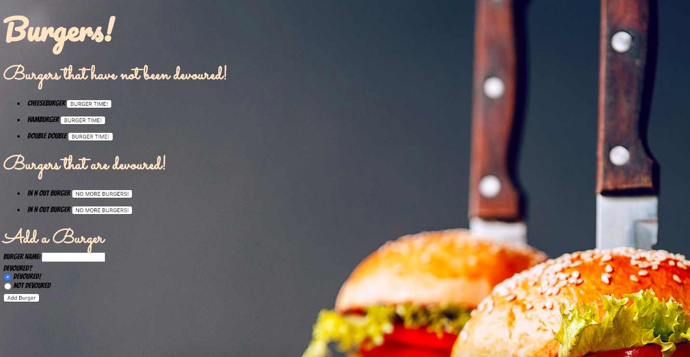

# Eat-Da-Burger (using Sequelize)



 This is a full stack web app that integrates a MySQL database of different types of burgers and uses it to query and route data. Using MVC architecture by implementing Handlebars to generate HTML content.

 Once up and running, you can enter your favorite burgers into the app and devour them!

### Prerequisites

Make sure to have the following installed on your computer. You will need to download [Node.js](https://nodejs.org/en/download/).

Then clone down this repo onto your computer.

### Installing

Within your command line, navigate to the repo and install all necessary dependencies by running the following:
```
npm i
```

## MySQL

In order for the app to render locally, you will need to use the included schema and seeds files to generate a database in your preferred GUI tool. 

## Deployment

The deployed version of this app is hosted on heroku [here](https://limitless-tundra-97966.herokuapp.com/).

To initialize this app locally on your machine type into your terminal the following
```
node server.js 
```

 This will set up a local server on your computer. Navigate to the server in your browser by visiting http://localhost:8080/

To end the sever connection simply hold down ctrl + c inside of your terminal.

## Built With

* HTML5 & CSS3
* [JavaScript](https://www.javascript.com/) - Programming language
* [Sequelize](http://docs.sequelizejs.com/) - ORM used
* [Express.js](https://expressjs.com/) - Routing framework
* [Handlebars](http://handlebarsjs.com/) - View engine
* [Node.js](https://nodejs.org/en/) - The backend JavaScript Framework

### NPM Packages
* [sequelize-cli](https://www.npmjs.com/package/sequelize-cli) - Command line interface
* [Express](https://www.npmjs.com/package/express)
* [Express Handlebars](https://www.npmjs.com/package/express-handlebars)
* [MySQL](https://www.npmjs.com/package/mysql) - Database
* [body-parser](https://www.npmjs.com/package/body-parser)


## Authors

* **Melika Kalbasi** - *Initial work* - [Burger](https://github.com/melikalbasi/burger)

## License

This project is licensed under the MIT License - see the [LICENSE.md](LICENSE.md) file for details

## Acknowledgments

Big thank you to my professor Jerome and tutor Denis for supporting me through my times of confusion.